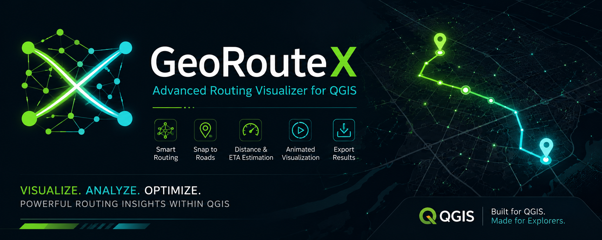

# **GeoRouteX**

#### **Advanced Routing Visualizer for QGIS**

  
 
  
 
      

## **🌌 Overview**

**GeoRouteX** is a modern routing visualization plugin for QGIS designed to transform GIS road networks into interactive shortest-path simulations.

Built with a balance of:

*performance • visualization • usability*

**GeoRouteX** enables users to:

* build routing graphs from GIS layers
* compute shortest paths dynamically
* visualize network traversal animations
* estimate travel distance and ETA
* export shortest path results
* work directly with OSM-style road datasets

The plugin focuses on:

*lightweight real-world routing visualization*

without requiring enterprise-scale infrastructure.

### **✨ Features**

##### **🧭 Intelligent Routing**

* Dijkstra shortest-path algorithm
* Speed-aware travel-time routing
* Real physical distance calculation
* ETA estimation

##### 🛰 **Smart Snap-to-Road**

* Click anywhere on the map
* Automatically snaps to nearest road segment
* More realistic route selection

##### **🎬 Animated Visualization**

* Live network exploration animation
* Dynamic shortest-path rendering
* Adjustable animation speed
* Educational traversal visualization

##### **📏 Route Information**

Displays:

* start point
* end point
* live route drawing distance
* total shortest-path distance
* estimated travel time

##### **💾 Export Support**

Export computed shortest paths as:

* Shapefile (.shp)
* GeoPackage (.gpkg)

for additional GIS workflows.

##### **🌍 OSM Compatibility**

GeoRouteX supports:

* OpenStreetMap road layers
* highway classification parsing
* automatic speed generation

If no speed field exists, the plugin automatically estimates speed using road type classification.

###### **🖼 Interface Preview**

**Splash Screen**

  

###### **Routing Visualization**

  

#### **⚙️ Installation**

##### **Method 1 — Install from ZIP**

1. Open QGIS
2. Navigate to:

***Plugins → Manage and Install Plugins → Install from ZIP***

3. Select the GeoRouteX ZIP package
4. Enable the plugin
5. GeoRouteX will appear in:

&#x09;Toolbar

&#x09;Plugins Menu

### **🚀 Quick Workflow**

#### **1️⃣ Load Road Layer**

Load a line-based road network layer:

* .shp
* .gpkg
* .geojson
* OSM-derived roads

#### **2️⃣ Build Routing Graph**

Click:

⚙ ***Build Graph***

GeoRouteX automatically:

* extracts vertices
* builds graph topology
* creates network connections
* generates speed field if missing

#### **3️⃣ Start Routing**

Click:

***▶ Start Routing***

Then:

* select start location
* select destination

The plugin automatically snaps to nearest valid road segments.

#### **4️⃣ Watch Network Traversal**

GeoRouteX visualizes:

* graph exploration
* node traversal
* shortest-path computation
* final optimal route

in real time.

#### **5️⃣ Export Results**

Click:

💾 ***Export Shortest Path***

to save routing outputs as GIS layers.

#### 🧠 **Routing Logic**

GeoRouteX currently uses:

###### **Dijkstra Shortest Path Algorithm**

Routing cost is computed using:

***travel\_time = distance / speed***

This enables:

* realistic ETA estimation
* transportation-style analysis
* speed-aware path optimization

#### 🌍 **Supported GIS Formats**

Format	                Supported

Shapefile (.shp)	✅

GeoPackage (.gpkg)	✅

GeoJSON (.geojson)	✅

KML	                ✅

SQLite          	✅

##### 🧪 **Recommended Data Sources**

###### OpenStreetMap (OSM)

Recommended sources:

* Geofabrik
* QuickOSM
* BBBike exports

##### **⚡ Performance Philosophy**

GeoRouteX intentionally prioritizes:

***stability • responsiveness • accessibility***

instead of extremely heavy computational features.

This makes the plugin practical for:

* students
* researchers
* educators
* GIS analysts
* standard desktop systems

without requiring high-end hardware.

##### 📂 **Plugin Structure**

GeoRouteX/

│

├── \_\_init\_\_.py

├── plugin.py

├── dialog.py

├── metadata.txt

├── icon.png

├── README.md

├── LICENSE

│

├── assets/

│   ├── banner.png

│   ├── splash\_screen.png

│   └── screenshots/

##### 🔮 **Future Roadmap**

Potential future enhancements:

* A\* routing
* traffic-aware analysis
* multi-modal transport
* frame/video generation
* advanced network analytics
* routing statistics dashboard

👨‍💻 Developer

Suman Saurabh

Built using:

* Python
* PyQGIS
* Qt / PyQt
* GIS Network Analysis Concepts

📜 License

MIT License

⭐ GeoRouteX

Visualize. Analyze. Optimize.

  

